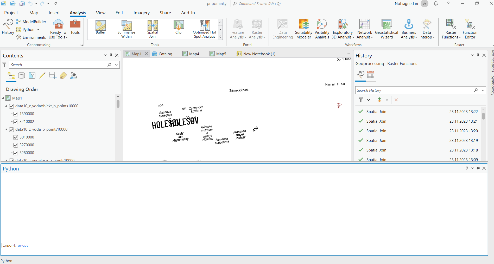
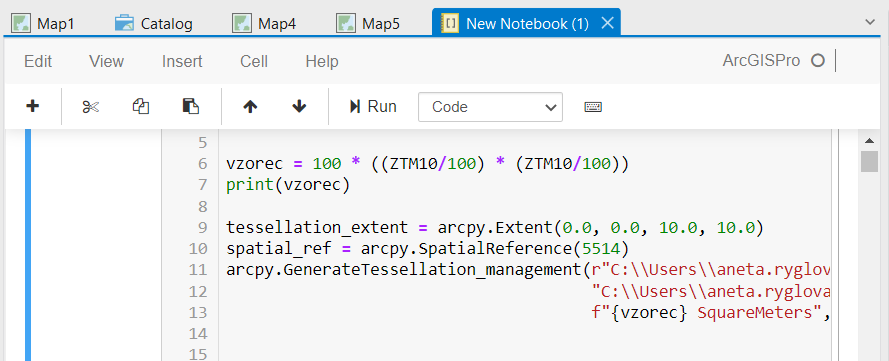
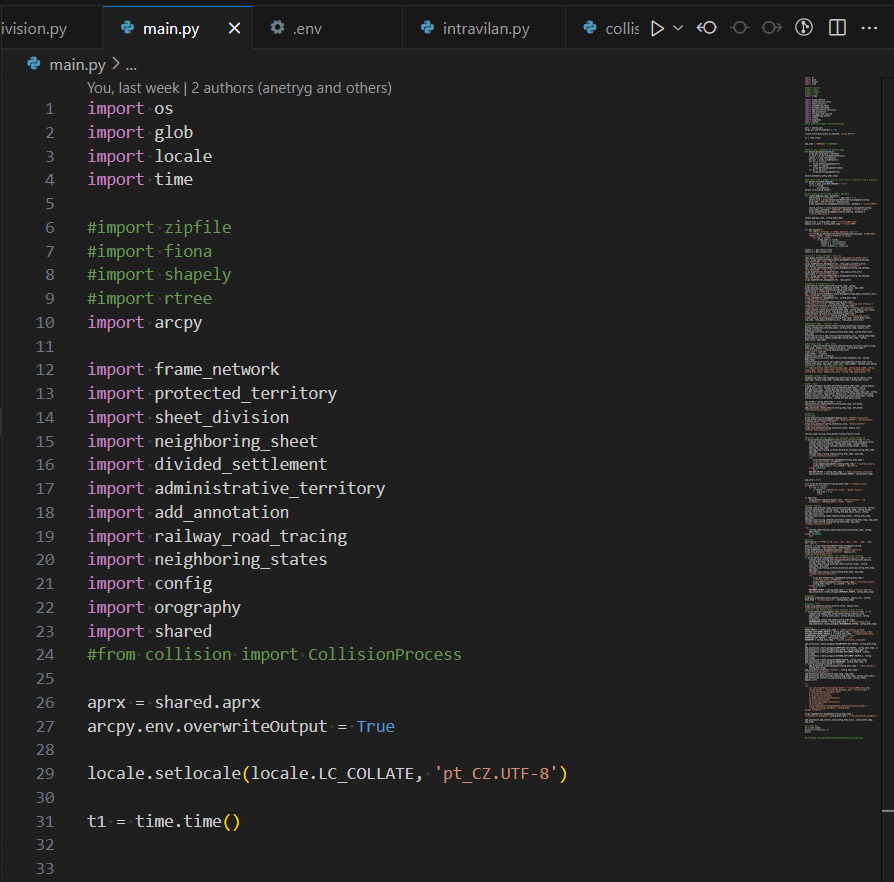
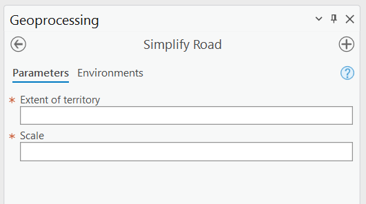
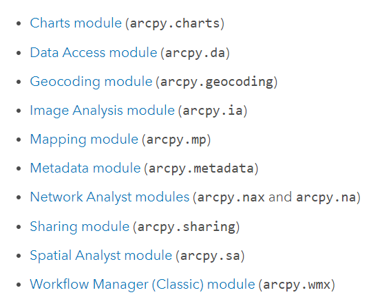
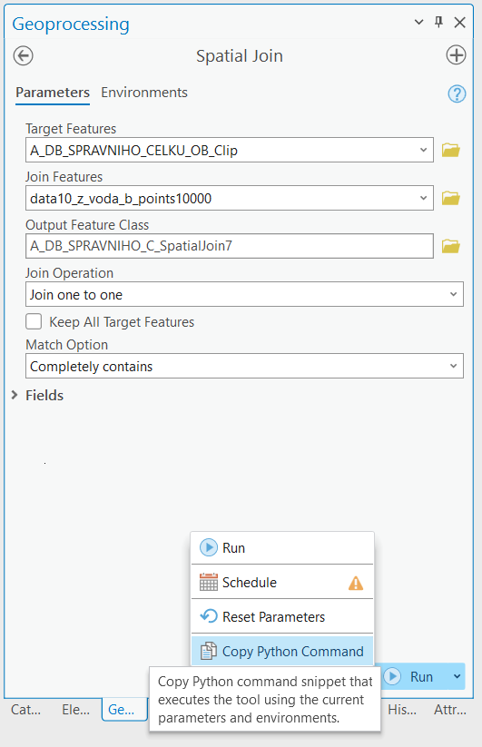
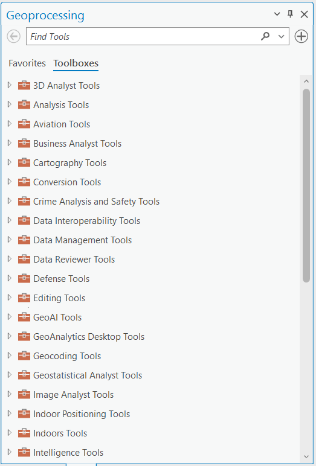

## Python v ArcGISu Pro
### Python window
* Python Window je interaktivní okno v ArcGIS Pro, které umožňuje uživatelům psát a spouštět Python skripty přímo v prostředí ArcGIS. Uživatelé mohou okamžitě testovat a vykonávat Python příkazy, zobrazovat výstupy a pracovat s daty v reálném čase. To usnadňuje rychlé experimentování s kódem a analýzou dat.



### Python Notebook
* Python Notebook je prostředí pro psaní, spouštění a sdílení Python skriptů v notebookovém formátu. Podporuje kombinaci textových buněk (Markdown) a buněk obsahujících Python kód. Python Notebook je ideální pro dokumentaci a sdílení pracovních postupů, analýz a vizualizací. Uživatelé mohou vytvářet interaktivní zprávy obsahující kód, grafy a komentáře.



### Samostatné skripty
* Uživatelé mohou vytvářet samostatné Python skripty, které mohou spouštět z příkazové řádky nebo jiného prostředí, nikoli však přímo z ArcGIS Pro. Standalone skripty jsou užitečné pro jednorázové úkoly, automatizaci opakujících se úloh nebo pro integraci s jinými nástroji a systémy.



Aby šel ArcPy naimportovat, musí skript běžet nad Pythonem, který si nese ArcGIS Pro ve vlastním prostředí. Samostatně nainstalovaný Python nestačí.

```
C:\Program Files\ArcGIS\Pro\bin\Python\envs\arcgispro-py3\python.exe muj_skript.py
```

### Python toolbox
* Python Toolbox je sada nástrojů vytvořených pomocí Pythonu a poskytujících uživatelům přístup k vlastním geoprocesingovým nástrojům a funkcím. Uživatelé mohou vytvářet vlastní nástroje a analytické procesy pomocí Pythonu a sdílet je s ostatními uživateli. Tímto způsobem mohou přizpůsobit a rozšířit schopnosti ArcGIS Pro.



```python
# -*- coding: utf-8 -*-

import arcpy


class Toolbox:
    def __init__(self):
        """Define the toolbox (the name of the toolbox is the name of the
        .pyt file)."""
        self.label = "Toolbox"
        self.alias = "toolbox"

        # List of tool classes associated with this toolbox
        self.tools = [Tool]


class Tool:
    def __init__(self):
        """Define the tool (tool name is the name of the class)."""
        self.label = "Tool"
        self.description = ""
        self.canRunInBackground = False

    def getParameterInfo(self):
        """Define parameter definitions"""
        params = None
        return params

    def isLicensed(self):
        """Set whether tool is licensed to execute."""
        return True

    def updateParameters(self, parameters):
        """Modify the values and properties of parameters before internal
        validation is performed.  This method is called whenever a parameter
        has been changed."""
        return

    def updateMessages(self, parameters):
        """Modify the messages created by internal validation for each tool
        parameter.  This method is called after internal validation."""
        return

    def execute(self, parameters, messages):
        """The source code of the tool."""
        return

    def postExecute(self, parameters):
        """This method takes place after outputs are processed and
        added to the display."""
        return
```


## ArcPy
Jedná se o Python knihovnu, která umožňuje provádět analýzu geografických dat, správu dat a automatizaci pomocí Pythonu. ArcPy je součástí instalace ArcGIS Desktop nebo ArcGIS Pro. Po instalaci máte přístup k Pythonu s nainstalovaným ArcPy. Jelikož ArcPy využívá možnosti ArcGISu, je nutné mít ArcGIS Pro nebo ArcGIS Desktop nainstalovaný a s platnou licencí. 



Knihovnu ArcPy importujeme stejně jako jsme si ukazovali u jiných knihoven.

```python
import arcpy
```

### Geoprocessing
ArcPy poskytuje širokou škálu geoprocessingových nástrojů, které lze volat přímo z Python skriptu. Pro volání geoprocessingových funkcí v arcpy se nejčastěji používá funkce arcpy.management.<název_nástroje> nebo arcpy.analysis.<název_nástroje>. Parametry nástrojů jsou pak předávány pomocí argumentů funkce. Například, pro použití nástroje "Buffer" pro vytvoření bufferu kolem vrstvy bodů, by se mohl použít následující kód:

```python
import arcpy

# Nastavení prostředí (např. cesta k workspace)
arcpy.env.workspace = "C:/data"

# Volání nástroje Buffer
arcpy.analysis.Buffer("points_layer", "buffer_layer", "500 Meters")
```
V tomto příkladu arcpy.analysis.Buffer volá nástroj "Buffer" na vrstvě bodů s vytvořením bufferu o poloměru 500 metrů a výsledky ukládá do nové vrstvy "buffer_layer". Viz dokumentace https://pro.arcgis.com/en/pro-app/latest/tool-reference/analysis/buffer.htm 

V ArcGISu Pro je i možnost zkopírovat si příkaz pro použití v rámci Pythonu s přímo použitými parametry:



Veškeré nástroje dostupné v geoprocessingu můžeme volat tímto způsobem




### arcpy.da
* modul Data Access umožňuje práci s daty
* SearchCursor

```python
import arcpy

fc = 'Z_AdmUzemi_B'
fields = ['POC_OBYV_M', 'VYZNAM_DBO'] # ['*'] vybere všechny sloupce 

# vyhledávání v atributové tabulce
with arcpy.da.SearchCursor(fc, fields) as cursor:
    for row in cursor:
        if (row[0] >= 5000 and 'Obec' in row[1]):
            print(f'{row[1]} s {row[0]} obyvateli spadá do kategorie')
            
```

* Update Cursor

```python
import arcpy

fc = 'Z_AdmUzemi_B'
fields = ['POC_OBYV_M', 'VYZNAM_DBO', 'vlastni_sloupec'] # ['*'] vybere všechny sloupce 

# úprava v atributové tabulce
with arcpy.da.UpdateCursor(fc, fields) as cursor:
    for row in cursor:
        if (row[0] >= 5000 and 'Obec' in row[1]):
            row[2] = 1 # např nastavení nějaké kategorie
            cursor.updateRow(row)
        else:
            cursor.deleteRow(row)
        
```

* InsertCursor

```python
import arcpy

# vytvoření linie
array = arcpy.Array([arcpy.Point(459111.6681, 5010433.1285),
                     arcpy.Point(472516.3818, 5001431.0808),
                     arcpy.Point(477710.8185, 4986587.1063)])
polyline = arcpy.Polyline(array)

# přidání prvku do stávající geometrie
with arcpy.da.InsertCursor('Z_KomSilnice_L', ['SHAPE@']) as cursor:
    cursor.insertRow([polyline])
```


### arcpy.charts
* modul umožňující vizualizaci pomocí grafů

```python
import arcpy

chart = arcpy.charts.Histogram("length")
chart.dataSource = "silnice_linie.shp"
chart.title = "Délka silnic"
chart.exportToSVG("histogram.svg", width=1000, height=800)
```

```python
import arcpy

lyr = arcpy.mp.ArcGISProject("current").listMaps()[0].listLayers()[0]
chart = arcpy.charts.Line(x="date", y="aqi", aggregation="mean")
chart.dataSource = lyr
chart.exportToSVG("line_graph.svg", width=1000, height=800)
```

### arcpy.mp
* modul pro manipulaci s obsahem existujících projektů (.aprx) a souborů vrstev (.lyrx), obsah projektů můžete upravovat, aniž byste museli projekt otevírat, poskytuje i funkce, které nejsou přímo v ArcGISu Pro dostupné (například pro správu dokumentů PDF)

```python
import arcpy
# odkaz na projekt
aprx = arcpy.mp.ArcGISProject(r"...\Yosemite.aprx")
# výběr mapy v projektu
lyt = aprx.listLayouts("Main Attractions*")[0]

lyt.exportToPDF(r"...\Yosemite.pdf", resolution=300)
```

Vzorové skripty: https://www.arcgis.com/home/group.html?sortfield=modified&sortorder=desc&id=398a345905c845e38229c15f5353d4e9&view=list&sortOrder=desc&sortField=added&rsource=https%3A%2F%2Flinks.esri.com%2Fmapautomationsamplescripts#content 


## Python CIM
V rámci ArcGIS je Python CIM Access klíčovým prvkem pro manipulaci s Cartographic Information Model (CIM) pomocí skriptovacího jazyka Python. CIM je datový model v ArcGIS, který popisuje a uchovává informace o mapové prezentaci, včetně vlastností vrstev, symbolů, rozvržení stránky a dalších kartografických prvků. S pomocí arcpy modulu lze přistupovat k těmto informacím a dynamicky je měnit v průběhu skriptu, což umožňuje tvorbu flexibilních a automatizovaných kartografických procesů.

Při používání Python CIM Access v rámci arcpy jsou k dispozici funkce pro čtení a zápis vlastností CIM objektů. To zahrnuje manipulaci se vzhledem mapových vrstev, definování a změny symbolů, nastavení vlastností mapových rámců a další. Skrze arcpy lze snadno získávat přístup k CIM objektům, jakými jsou vrstvy, rámečky nebo symboly, a dále je upravovat podle specifických požadavků. Tato funkcionalita umožňuje vývojářům vytvářet a automatizovat složité kartografické procesy, což výrazně zvyšuje flexibilitu a efektivitu práce s geografickými daty v prostředí ArcGIS.

```json
{
  "type" : "CIMLayerDocument",
  "version" : "3.2.0",
  "layers" : [
    "CIMPATH=map/greatlakes.xml"
  ],
  "layerDefinitions" : [
    {
      "type" : "CIMFeatureLayer",
      "name" : "GreatLakes",
      "uRI" : "CIMPATH=map/greatlakes.xml",
      "useSourceMetadata" : true,
      "description" : "GreatLakes",
      "layerType" : "Operational",
      "showLegends" : true,
      "visibility" : true,
      "displayCacheType" : "Permanent",
      "maxDisplayCacheAge" : 5,
      "showPopups" : true,
      "serviceLayerID" : -1,
      "autoGenerateFeatureTemplates" : true,
      "featureElevationExpression" : "0",
      "featureTable" : {
      "htmlPopupEnabled" : true,
      "selectable" : true,
      "featureCacheType" : "Session",
      "scaleSymbols" : true,
      "snappable" : true
```

```python
# Reference a project, map, and layer using arcpy.mp
p = arcpy.mp.ArcGISProject('current')
m = p.listMaps('Map')[0]
l = m.listLayers('GreatLakes')[0]

# Return the layer's CIM definition
l_cim = l.getDefinition('V3')

# Modify a few boolean properties
l_cim.showMapTips = True  #Turn on map tips for bubble tips to appear
l_cim.selectable = False  #Set the layer to not be selectable
l_cim.expanded = True     #Expand the Layer in the Contents pane

# Push the changes back to the layer object
l.setDefinition(l_cim)

# Save changes
p.save()
```
